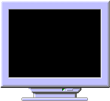

<div align="center">

## Complete ScreenSaver


</div>

### Description

I know there are a lot of ScreenSaver examples on PSC, but I have not seen a complete one.

This example includes:

Thumbnail Preview

Password Protection

Password Change

Set Up

The actual screensaver is nothing special, so please don't comment on the excellent graphics.

I can only test on WIN ME so if this code does not work with other OS's, then this is the feedback that I want. I know of some probs with NT and believe I have handled those, but I can't test that.

I am not looking for votes, just feedback.
 
### More Info
 


<span>             |<span>
---                |---
**Submitted On**   |2001-08-13 17:28:52
**By**             |[Mick Doherty](https://github.com/Planet-Source-Code/PSCIndex/blob/master/ByAuthor/mick-doherty.md)
**Level**          |Intermediate
**User Rating**    |4.5 (18 globes from 4 users)
**Compatibility**  |VB 5\.0
**Category**       |[Miscellaneous](https://github.com/Planet-Source-Code/PSCIndex/blob/master/ByCategory/miscellaneous__1-1.md)
**World**          |[Visual Basic](https://github.com/Planet-Source-Code/PSCIndex/blob/master/ByWorld/visual-basic.md)
**Archive File**   |[Complete S246218142001\.zip](https://github.com/Planet-Source-Code/mick-doherty-complete-screensaver__1-26181/archive/master.zip)

### API Declarations

```
VerifyScreenSavePwd
PwdChangePassword
ShowCursor
GetClientRect
GetWindowLong
SetWindowLong
SetParent
SetWindowPos
FindWindow
SystemParametersInfo
GetVersionEx
```


